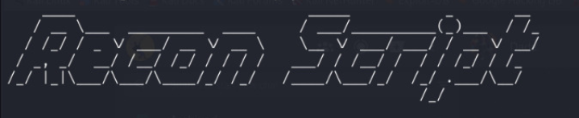

<h1 align="center">
  
   
</h1>

# Fast Subdomain Enumeration Tool

Recon-Script is a subdomain search tool that helps in finding valid subdomains of websites using various tools. It helps you to find subdomains from different tools from one place, this script goes through all the tools one by one and collect all the data and store it in file then sort all the unique subdomains and Gets the status code by sending it to httpx-toolkit to check and save the output automatically in file.

# Features 

- Optimized for speed and lightweight on resources
- Easy to use

# Usage

     python3 recon-script.py

Then enter the target domain

# Installation 

    git clone https://github.com/jonnybravo7666/recon-script.git
    cd recon-script
    pip install pyfiglet

# Prerequisite
- To use this tool you have to install few other tools like subfinder, assetfinder, findomain and httpx-toolkit.

# Subfinder
- Subfinder tool requires go1.20 to install successfully. Run the following command to install the latest version:
  
      go install -v github.com/projectdiscovery/subfinder/v2/cmd/subfinder@latest
  
# assetfinder
- Assetfinder tool requires go language to install successfully. Run the following command to install the latest version:

      go get -u github.com/tomnomnom/assetfinder

# findomain
- Run the following command to install the latest version:
  
      git clone https://github.com/findomain/findomain.git
      cd findomain
      cargo build --release
      sudo cp target/release/findomain /usr/bin/
      findomain

# httpx-toolkit
- Run the following command to install the latest version:

      sudo apt install httpx-toolkit

